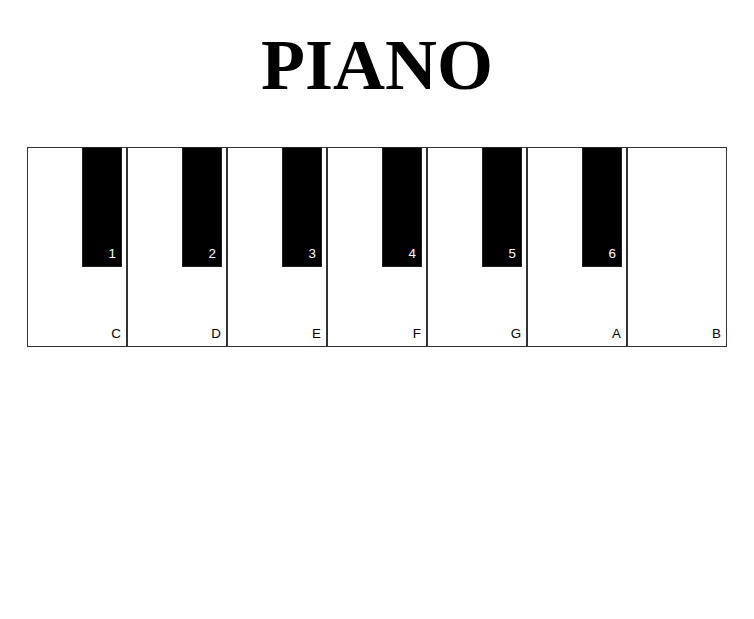

## 🎹 Simple jQuery Piano

A simple web-based piano built with HTML, CSS, and jQuery.
Play both major and minor chords directly from your browser, either by clicking the keys or pressing keyboard keys.

## 📋 Features

- Play notes by clicking keys or pressing your keyboard.

- White keys (C, D, E, F, G, A, B) = major chords.

- Black keys (1–6) = minor chords.

- Preloaded audio files for each chord (stored locally in the /sounds folder).

- Simple and minimal interface.

- Built using jQuery for event handling.

## 🎼 Controls
| Key |  Sound  |
|-----|---------|
|  C  | C major |
|  1  |	C minor |
|  D  | D major |
|  2  |	D minor |
|  E  |	E major |
|  3  |	E minor |
|  F  |	F major |
|  4  |	F minor |
|  G  |	G major |
|  5  |	G minor |
|  A  |	A major |
|  6  |	A minor |
|  B  |	B major |
|-----|---------|

## 🚀 How to Use

- Clone or download this repository.

- Make sure all audio files are inside the /audio folder.

- Open index.html in your browser.

- Click on the keys or press the corresponding keyboard keys to play.

## Preview

## 🎶 Example Chord Progression

** To try something pleasant sounding: **

- C → Am → F → G (happy mood)

- Am → F → C → G (emotional feel)
